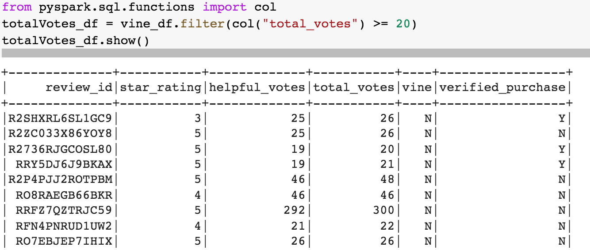
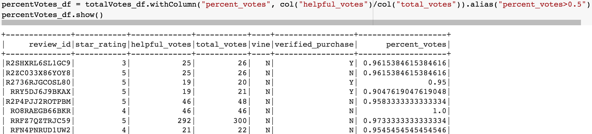
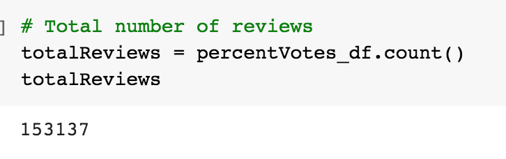
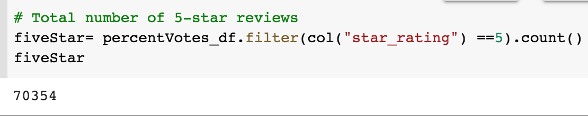
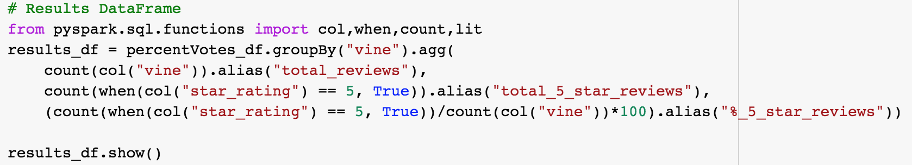
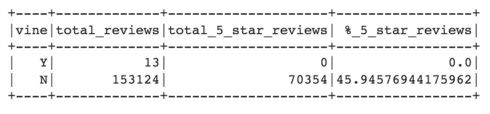

# Amazon Vine Analysis
## Project Overview
The purpose of this project is to analyze reviews written by members of the paid Amazon Vine program. The Vine program allows manufactures and publishers to recieve reviews of their products. I chose to analyze the dataset for product reviews in the "Music" category. Using PySpark, I will perform the ETL process to extract the dataset, transform the data, connect to my AWS RDS instance, and finally export the results into PgAdmin SQL tables. My goal through this analysis is to determine if there is any bias toward favorable reviews from Vine memebers and the percentage of 5-star reviews of paid Vine reviews compared to those that were not.  
## Analysis
The "Music" category dataset held over 4 million written reviews. However, for this analysis, we wanted to narrow the scope to focus on the reviews that would be most helpful. 

- To do this, we first filtered the data into a new dataframe to display all rows where the total_votes count is equal to or greater than 20. 

- Next, we filtered that newly created dataframe to retrieve all rows where the number of helpful_votes divided by total_votes is equal to or greater than 50%. This filtered data was then loaded into a new dataframe. 

The filtered data was then used to extract the results we need and perform analysis on the question of bias in terms of Vine reviews vs non-Vine reviews. 

## Results 
### 1. How many Vine reviews and non-Vine reviews were there?
- There was a total number of 153,137 reviews.
- Out of those 153, 137 reviews: 
	- 13 paid Vine reviews
	- 153,124 non-Vine reviews
	

### 2. How many Vine reviews were 5 stars? How many non-Vine reviews were 5 stars?
- There was a total of 70,354 5-star reviews.
- Of those 70,354:
	- 0 Vine members gave a 5-star rating
	- 70,354 non-Vine members gave a 5-star rating

### 3. What percentage of Vine reviews were 5 stars? What percentage of non-Vine reviews were 5 stars?
- Of the 70,354 5-star reviews:
	- 0% were contributed by Vine memebers 
	- 45% were contribute by non-Vine memebers

## Summary
The results from the Amazon "Music" category written reviews dataset indicate that Vine members did not show a bias when it came to rating the prodcut they recieved, given that 0% of the members gave a 5-star product rating. Based of this, we can assume there is no bias for reviews in the Vine program. The number of 5-star reviews is significantly higher amongst those who are non-Vine memebers. 

To further support this assumption, it would be helpful to analyze the entire dataset without filtering out reviews where the number of helpful votes vs total votes fell below 50%. Also, extending analysis into more than one product category would allow us to conduct a more solid analysis on whether bias is present among Vine members. Lastly, it would be useful to filter the data to verified purchases vs Vine member standing. 
